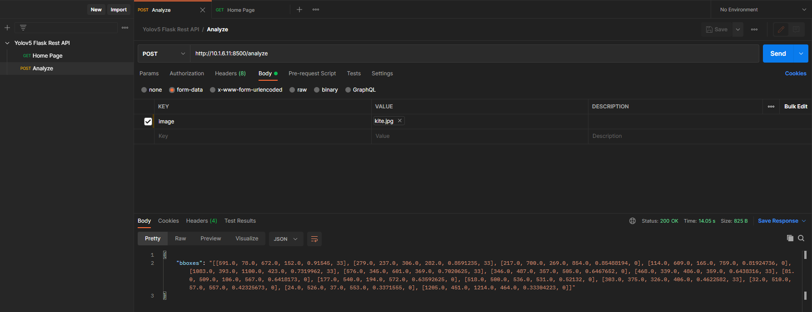
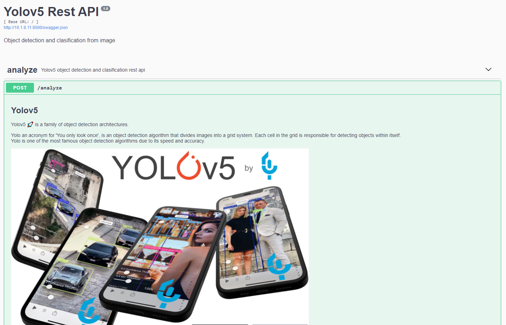

# PyACL Flask Rest API
This is a simple python object detection and classification server using [yolov5](https://gitee.com/tianyu__zhou/pyacl_samples/tree/a800/acl_yolov5_pt).

This server runs multithreaded. The requests from many different users at the same time are queued and sent to the asynchronous inference server using the [Redis](https://redis.io/)(message queuing/message brokering) infrastructure. 

Please, follow the steps bellow for an easy demo.


## Getting started
Install python dependencies;
- redis
- numpy
- Pillow
- requests
- werkzeug
- configparser
- opencv-python-headless
- flask-restplus==0.12.1
- flask==1.0.3

```
pip install -r requirements.txt
```

Install Linux(Ubuntu 18.04/20.04) packages;
- redis

```
sudo apt-get update -y
sudo apt-get install redis-server -y
```


## PT model -> ONNX format -> Ascend om format
### Get PT file
Download the `PT` file of from this link,
- https://github.com/ultralytics/yolov5/releases/tag/v2.0
- Upload the pt file to `weights` directory

### PT -> ONNX
Use the `onnx_exporter/export.py` script in this repository to convert `PT` file to `ONNX` file.

### Remove a few operators in the ONNX file
The  **Slice** and  **Transpose** operators will slow down the model inference significantly. Use the `onnx_exporter/modify.py` script in this repo to remove the impact of these operators.

### ONNX -> OM
```bash
cd ./weights
atc --model=yolov5s_modify.onnx \
    --framework=5 \
    --output=yolov5s_modify \
    --soc_version=Ascend310 \
    --input_shape="images:1,12,320,320" \
    --out_nodes="Reshape_216:0;Reshape_231:0;Reshape_246:0"
```


## Run Server
Open the terminal on the project path and then run the following command.

```bash
./server_run.sh
```

**Note :** Import `Yolov5 Flask Rest API.postman_collection.json` file to [postman](https://www.postman.com/) collections for easy demo



### Swagger Usage
Swagger will be available `http://{server_ip}:{server_port}`.

Open web browser, upload an image and enjoy using [Swagger](https://swagger.io/) UI for easy demo!



### Stress Test
Open the terminal on the project path and then run the following command.

```bash
python3 utils/stress_test.py
```

**Note :** You can edit all app settings such as stress test, swagger etc. via data/app.cfg


## Docker Build & Run
First of all, download [Ascend-cann-nnrt_5.0.2_linux-x86_64.run](https://support.huawei.com/enterprise/zh/software/252806303-ESW2000387054) inference engine software package from [hiascend](www.hiascend.com/en/) website to project path and then build the docker image by running the following code on bash.

```bash
sudo docker build -t pyacl_flask_rest_api:1.0 \
                --build-arg NNRT_PKG=Ascend-cann-nnrt_5.0.2_linux-x86_64.run .
```

Finally, you can run the docker image with the following code on bash.

```bash
sudo docker_run.sh pyacl_flask_rest_api:1.0
```


## Resources
[1] https://support.huawei.com/enterprise/en/doc/EDOC1100206687/d6a371a4/image-classification-with-caffe-resnet-50-asynchronous-inference)

[2] https://support.huawei.com/enterprise/en/doc/EDOC1100209586/9a47874b/creating-a-container-image

[3] https://www.pyimagesearch.com/2018/02/05/deep-learning-production-keras-redis-flask-apache/

[4] https://phoenixnap.com/kb/install-redis-on-ubuntu-20-04


## Authors
Kubilay Tuna


## Copyright
Huawei Technologies Co., Ltd


## License
MIT